# Customizing Smart Voice project

## Introduction

This project contains all the source code for [NXP's Smart Voice UI solution](https://www.nxp.com/mcu-svui).\
For more information about getting up and running with the Smart Voice UI, check out the [Smart Voice UI Getting Started Guide](https://www.nxp.com/document/guide/getting-started-with-the-sln-svui-iot:GS-SLN-SVUI-IOT).

## Preparations needed

### Hardware prerequisites

- SLN-SVUI-IOT board
- USB Type-A to Type-C (should be included in the dev kit box)
- Jlink for flashing or debugging (with 9-pin adaptor, as shown below)

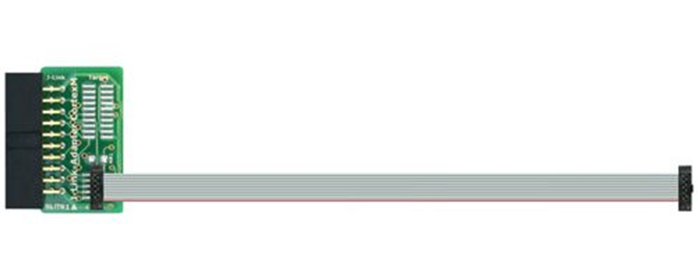

### Software prerequisites

- MCUXpresso 11.8.1
- MCUXpresso RT1060 EVKB 2.14.0 SDK
- Cyberon Dspotter Modeling Tool V2 (last tested version is 2.2.19.0)
- Serial connection software (Putty, Tera Term, MobaXterm, etc.)

### Download MCUXpresso 11.8.1

- Go to this URL: [https://www.nxp.com/mcuxpresso/ide](https://www.nxp.com/mcuxpresso/ide)
- Click on "Downloads" orange button

- Go to the "MCUXpresso Integrated Development Environment (IDE)" section and click "Download"

- You might be asked to login to your NXP account if not already logged in

- After logging in you will see the product information. Click on "MCUXpresso IDE" link

- Agree with the "Software Terms and Conditions", then you will have access to the download links

### Download MIMXRT1060-EVKB v2.14.0 SDK

- Go to this URL: [https://mcuxpresso.nxp.com/](https://mcuxpresso.nxp.com/)
- Press on "Select Development Board"

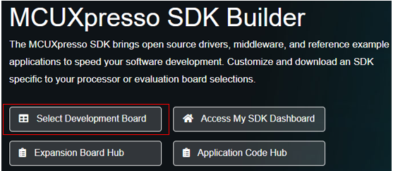 <br/><br/>

- In "Search for Hardware" input RT1060 EVKB
- The "MIMXRT1060-EVKB" board should appear in the results

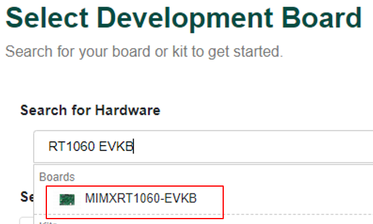 <br/><br/>

- Click on the board
- In the right side of the screen you should have the "Build MCUXpresso SDK" button
- SDK version should be 2.14.0 (if not selected by default)

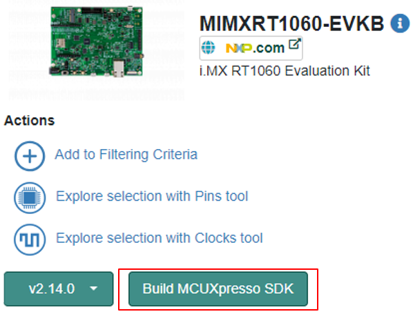 <br/><br/>

- Select "MCUXpresso IDE" as Toolchain if not already selected
- Click on "Download SDK" button from the bottom of the page

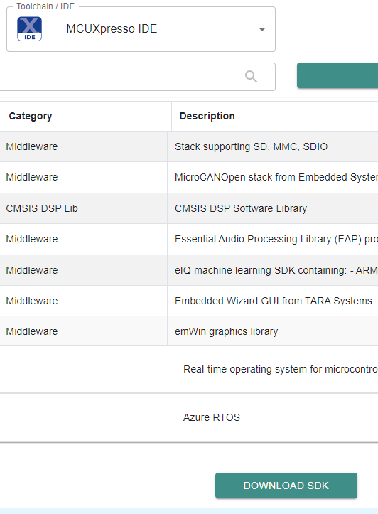 <br/><br/>

- The SDK might appear as building for a while
- Once ready, it will be available for download in the MCUXpresso SDK Dashboard

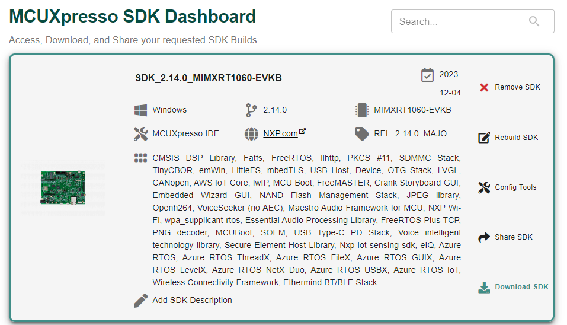 <br/><br/>

### Install SDK in IDE

- Open MCUXpresso IDE
- If it is the first time when the tool is opened, "Welcome" page will be displayed. You may close it

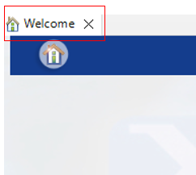 <br/><br/>

- You should now be able to see the "Installed SDKs" view
- To install the previously downloaded SDK, drag and drop the zip into this IDE view
- Below is an example with multiple SDKs already installed

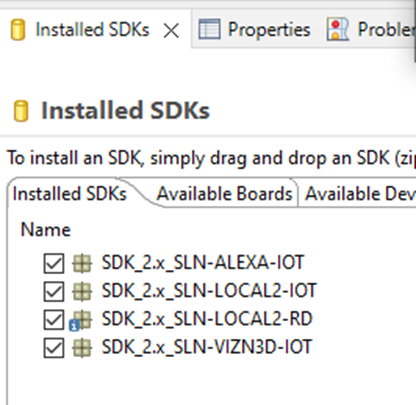 <br/><br/>

- You will be asked to confirm the SDK installation, press on "OK"

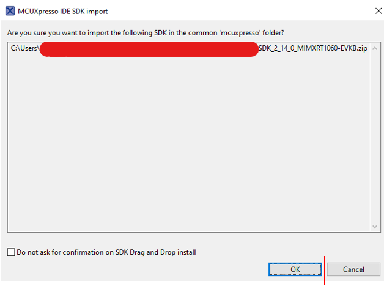 <br/><br/>

### Download Cyberon DSpotter Modeling Tool v2, version 2.2.19.0

- Go to this URL: [https://tool.cyberon.com.tw/DSMT_V2/index.php?lang=en](https://tool.cyberon.com.tw/DSMT_V2/index.php?lang=en)
- Scroll down until you reach "Download" section
- Click and download v2.2.19.0

### Update to latest binaries using pre-configured Ivaldi

- Before starting the customization examples, we need to make sure that we have the right setup and the board is running the latest NXP software.

### Using pre-configured Ivaldi

- The pre-configured Ivaldi is a ready-to-use tool specially designed to ease board updating process
- It can also be used as manufacturing tool
- It is available on [https://github.com/NXP/mcu-svui](https://github.com/NXP/mcu-svui) in **tools** folder
- After cloning the repository, the content for the pre-configured Ivaldi should look as in the image below:

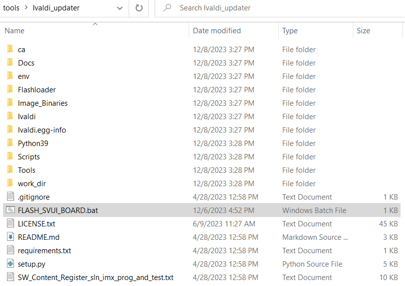 <br/><br/>

- In the Image_Binaries folder you can find:
    - the applications' images (bootstrap, bootloader, local_demo_vit and local_demo_dsmt)
    - the audio files that will be programmed in flash.\
      the binary containing the audio files (file_system) is automatically generated and added into the folder when running the script.

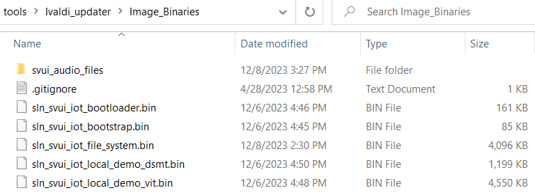 <br/><br/>

> [!NOTE]
> Do not move the jumper when the board is powered on.

- After powering off the board, put the board in **serial downloader mode** by moving jumper **J61** to connect **pins 2 and 3** (towards the buttons)

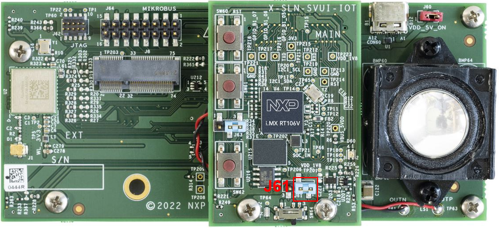 <br/><br/>

- Plug the USB Type-C connector into the SLN-SVUI-IOT board and the USB type-A connector into your computer
- Start the FLASH_SVUI_BOARD.bat script selected above
- The output should look like this:

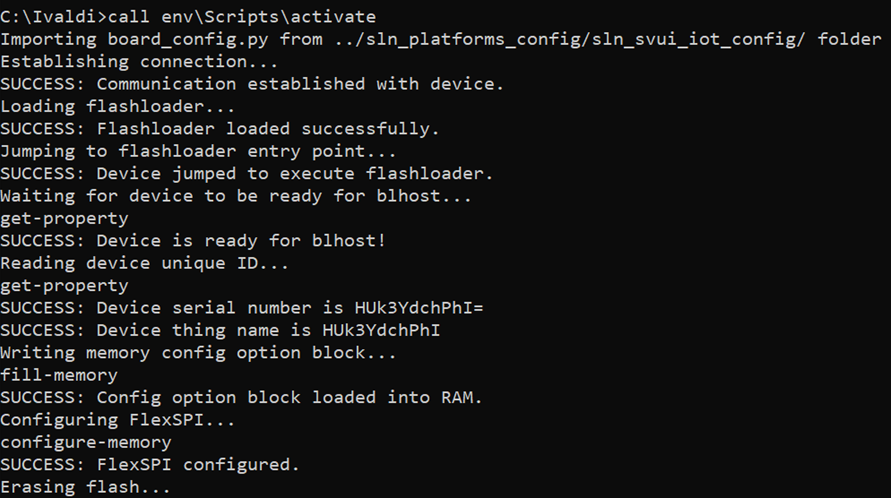

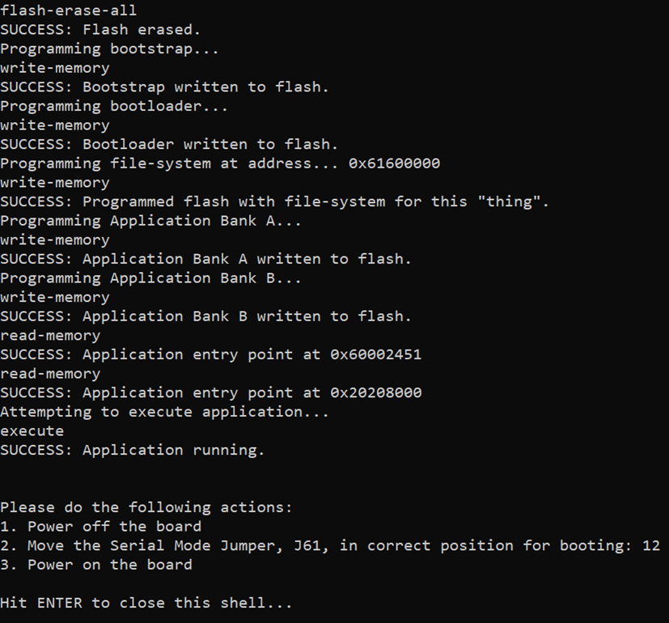 <br/><br/>

- When the update is done, disconnect the board, move the jumper to the initial position (connecting pins 1 and 2 - towards the speaker) and reboot the board.

## MSD update

### Generate binary from the axf

- Select and build the project.

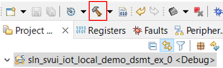 <br/><br/>

- Right click on the generated .axf file
- Go to Binary Utilities -> Create binary

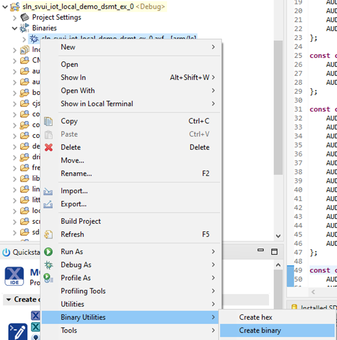 <br/><br/>

- Right click on the same .axf file, then go to Utilities -> Open directory browser here

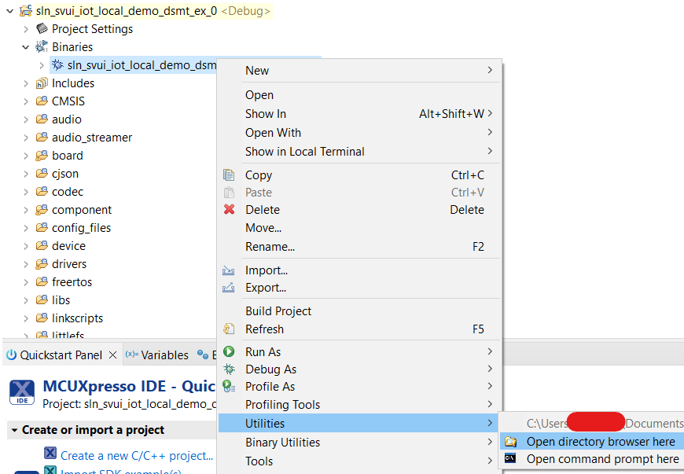 <br/><br/>

- You can now use the generated .bin for MSD update

### Enter MSD mode

- To put the device into MSD mode, hold down switch 2 (SW2) while board boots (remove the power, press SW2, re-insert the powering cable)
- LED should light pink, on and off at 3 seconds intervals
- Then a new drive should have been mounted
- Copy - paste or drag and drop the generated binary as you would do with a memory stick
- Blue LED will start to blink. When the process will end, green LED will blink once

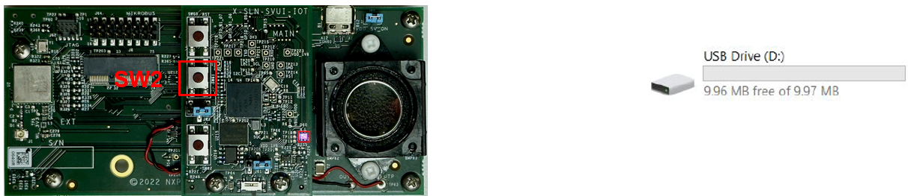 <br/><br/>

### Serial terminal setup

- Serial terminal can be used to
    - Switch between demos
    - Select languages
    - See logs (for detection and other events)
- Tera Term (Windows Only)
    - [https://osdn.net/projects/ttssh2/releases/](https://osdn.net/projects/ttssh2/releases/)
- PuTTY
    - [https://putty.org/](https://putty.org/)
- Serial connection settings are the ones below (COM port will need to be adapted accordingly):

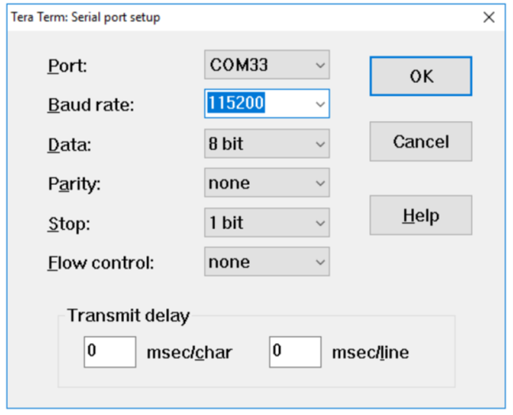 <br/><br/>

## Examples

This section contains examples for different VIT and DSMT implementations.

### VIT

- [Example 0 - Add a new command in the existing English demo](examples/VIT/example_0/README.md)
- [Example 1 - Add a new EN model](examples/VIT/example_1/README.md)
- [Example 2 - Modify App Layer API to control LED after command detection](examples/VIT/example_2/README.md)
- [Example 3 - Test and tune a VIT model](examples/VIT/example_3/README.md)
- [Example 4 - Add new audio prompts](examples/VIT/example_4/README.md)
- [Example 5 - Add a new ES model](examples/VIT/example_5/README.md)

### DSMT

- [Example 0 - Add a new command in the existing English demo](examples/DSMT/example_0/README.md)
- [Example 1 - Add a new EN model](examples/DSMT/example_1/README.md)
- [Example 2 - Add a new ES model](examples/DSMT/example_2/README.md)
- [Example 3 - Test and tune a DSMT model](examples/DSMT/example_3/README.md)

## Applying patches

### VIT patches

Use the patch name and path according to the example number:

```
git apply --whitespace=nowarn [PATH_TO_PATCH_FOLDER]/ex0_vit.patch
```

### DSMT patches

Use the patch name according to the example number:
```
dos2unix ex0_dsmt.patch
git apply --whitespace=nowarn [PATH_TO_PATCH_FOLDER]/ex0_dsmt.patch
```
